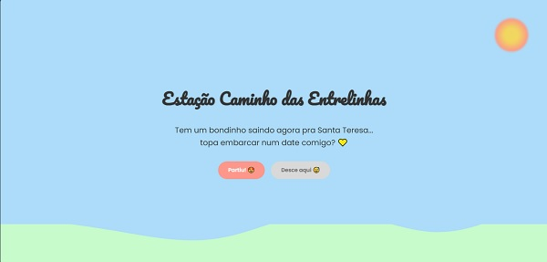

#  🚋 Estação Caminho das Entrelinhas

💛 **Um projeto interativo que simula um convite para um date no bondinho de Santa Teresa!**  

---

## 🌟 Como Funciona  
- Clique no bondinho para revelar o convite.  
- Escolha **"Partiu! 😍"** para ver fogos de artifício e uma mensagem positiva.  
- Ou **"Desce aqui 😅"** para um efeito dramático com corações partidos e nuvens cinzentas.  

---

## 🎨 Tecnologias Usadas  
- **HTML5** & **CSS3** (animações, variáveis CSS, gradientes)  
- **JavaScript** (interações, efeitos visuais)  
- **SVG Externos** (bondinho, colinas e nuvens) 

---

## 🚀 Como Usar  
1. Acesse o projeto online: [neste link.](https://rmcamila.github.io/ladeira_encantada/) 
2. Você pode acessar os arquivos do projeto clicando [aqui](https://github.com/rmcamila/ladeira_encantada.git).

---

## 🖼️ Preview  

  

---

## 📄 Licença  
The [MIT License](https://github.com/rmcamila/ladeira_encantada/blob/main/LICENSE) (MIT)

Copyright :copyright: 2025 - Camila Rodrigues

---

## Desenvolvedores 👩‍💻

 [Camila Rodrigues](https://github.com/rmcamila)

